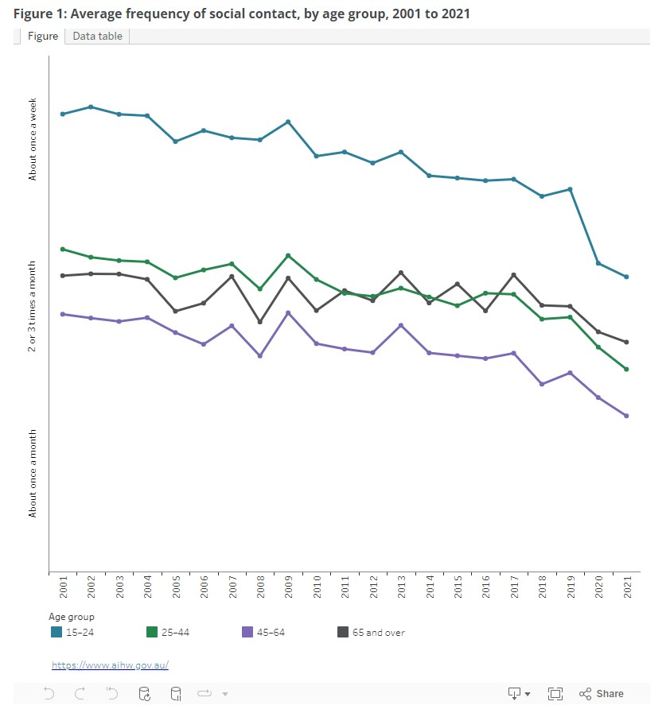
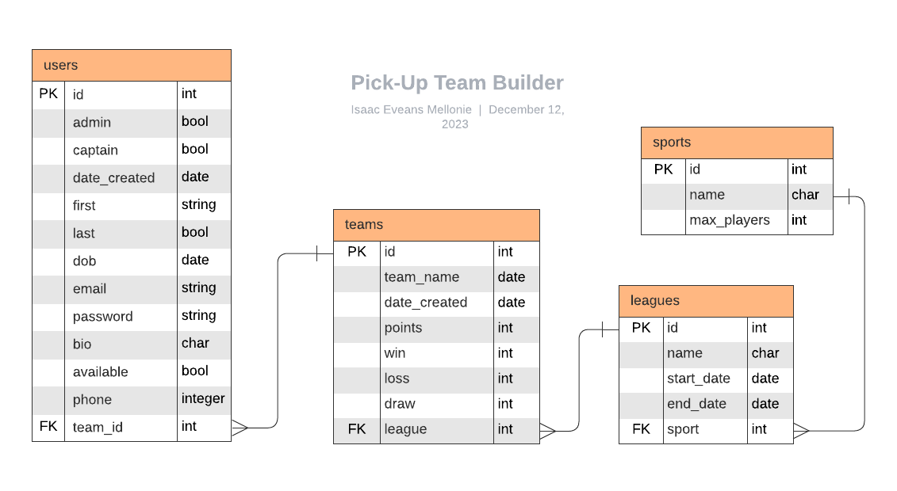
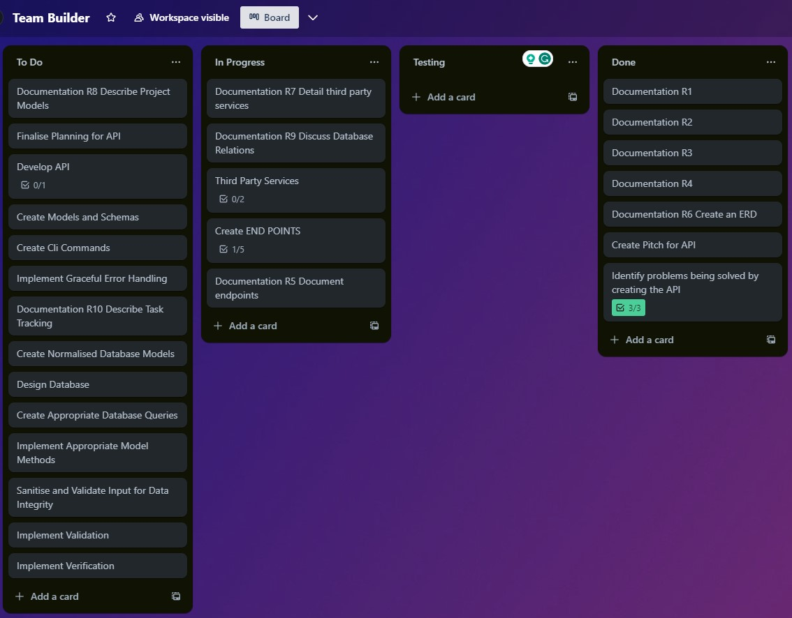
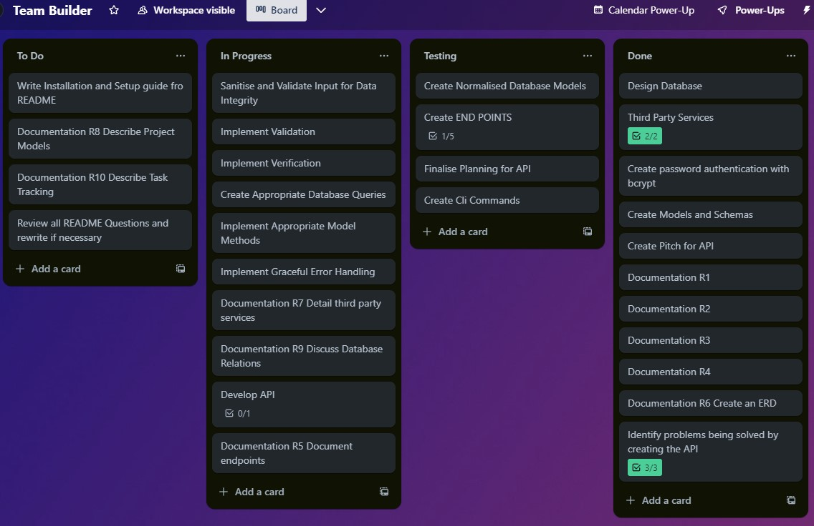

# API Webserver Project
## "Pick-Up" Team Builder

### Installation and Setup

---
### R1 Problem Identification

If you’ve ever played social team sports, you’ll know how tough it can be to get everyone to communicate whether they’re available each week. There are a few reasons for this, apart from the obvious heel-draggers who will always cause team admins to pull their hair out, there’s no easy way to create and manage a team for social sports leagues. 

Some simple solutions use social media to create polls or ask for a show of hands so to speak. Then there’s the old method of starting a group chat and texting everyone days before the game. All of these solutions are cumbersome and require tedious management. They also rely on the admin to act as a repository, which can cause headaches for league administrators and other players who need to update information constantly. This app will provide a more effective solution than what is currently available.

This app aims to address the following problems:

- Promote Well-being and Health: Many trickle-down benefits will affect the players involved. One of which is the increase in socialisation and physical activity. By increasing organised sports, community involvement and socialisation, players will see an increase in health benefits.

- Organisation and Scheduling: One primary challenge in managing sports teams and leagues is organising games and schedules. The app will provide a platform for creating and managing schedules, allowing players and teams to know when and where games are taking place.

- Team Formation and Management: Assist in forming teams by allowing players to sign up, and express their skill levels, and availability. This can help in balancing teams and ensuring that each team has the required number of players.

- Player Communication: Effective communication is crucial for coordinating games. The app can facilitate communication between team admins and their players through emails for game reminders and scheduling.

- Attendance Tracking and Player Availability: Keeping track of who is attending upcoming games is vital for ensuring that games can go ahead. The app will allow players to RSVP to games and provide visibility to others who will attend.

- Scorekeeping: Tracking scores and game results is essential for maintaining league ladders. Team positions will be calculated using collected score information that will be used to formulate team placement and play-off games. It’s also useful for league organisers interested in tracking progress and performance.

---
### R2 Why is it a problem that needs solving?

The challenges associated with organising and managing pick-up sports teams and leagues are significant problems. 

- Anxiety and Depression: Even 3 and a half years after the pandemic first hit, concerns about mental health and substance abuse have been elevated. According to the World Health Organisation (June 2022), “Young people have been left vulnerable to social isolation and disconnectedness which can fuel feelings of anxiety, uncertainty and loneliness and lead to affective and behavioural problems.” Regular exercise is proven to be effective in reducing anxiety and depressive symptoms by releasing endorphins and serotonin which can improve mode.

- Health and Fitness Promotion: The physical benefits of social sports and regular exercise are also problems that need addressing. Regular exercise can help prevent and manage stroke, metabolic syndrome, high blood pressure, type 2 diabetes, depression, anxiety, many types of cancer, and arthritis.

- Build friendships through socialisation. According to the Australian Institute of Health and Welfare (2022) social contact survey (see attached), interactions have been steadily declining since 2001. The most notable drop occurred in young adults ages 15-24. The app makes it easier to find connections in competitive or non-competitive settings. Promoting inclusivity and accessibility to people who may feel nervous about joining a league.

- Time and Resources: Without a centralised system, organising games can be time-consuming and inefficient, often relying on disjointed communication methods like social media, emails, or word-of-mouth. The app streamlines this process, saving time and making it easier for players to engage in activities.

- Accessibility and Inclusivity: Many people are interested in participating in sports but face barriers in accessing organised games or teams. Democratising access to sports by making it easier for individuals of all skill levels to find and join local games, and will foster a more inclusive community.

- Centralise Data: Creating a centralised system for storing users, teams, and league data will reduce redundancies, improve data integrity, add valuable insights, and reduce running costs. By having a centralised data point, the app can effectively communicate with all users. Securing user information is simpler with centralised data as it is easier to monitor and control who has access. Adding admin privileges is one way this is accomplished.

- Player Management: Without a system to match players by position and skill level, games can become unbalanced, leading to a less enjoyable experience. An app that considers skill levels and availability ensures more balanced and enjoyable games.

- Consistency and Commitment: Spontaneous or irregular sports games can lead to low commitment levels, resulting in games being cancelled or played with insufficient participants. A dedicated platform enhances commitment by providing structured schedules and reminders.

Solving these problems is essential for making sports more accessible, enjoyable, and safe, while also promoting health, fitness, and community engagement. The Team Builder app has the potential to significantly enhance the experience of participating in local sports, making it a valuable tool for individuals and communities alike. On the other hand, it provides beneficial management for administrators who need to deal with large sets of data.

---
### R3 Why have you chosen this database system. What are the drawbacks compared to others?

I’ve chosen to use the PostgreSQL database management system for my application due to its extensibility, support for complex data types, and scalability. The app must be using a database that offers support for future expansion, upgrades and additional features. PostgreSQL offers catalogue-driven operation which provides additionally stored information in the PostgreSQL catalogue. This is important due to the app requiring different data types within our tables. The app will also require different functions which PostgreSQL has extensible support for. In future, expansion will be necessary for added features such as an online socialisation aspect, and a payment system for player and team registration. Postgres can also handle large amounts of data and concurrent users efficiently, making it suitable for scalable web and mobile applications. The app will be built with the expectation of a large database of users and teams. Due to the expanding database requirements, PostgreSQL will be well-suited. 

When comparing PostgreSQL to MongoDB we find some advantages:

- Scalability: MongoDB is noted for its horizontal scalability. It can handle large volumes of data and high levels of user load by distributing data across multiple servers (sharding). While PostgreSQL has made significant improvements in scalability, it traditionally excels in vertical scaling (scaling up) rather than horizontal scaling (scaling out).

- Ease of Use for Development: Some developers find MongoDB more straightforward to use due to its JSON-like syntax, dynamic schema, and the fact that it doesn't require advanced SQL knowledge. This can speed up development in certain scenarios.

- Schema Flexibility: MongoDB is schema-less, which means you can insert data without first defining its structure. This is particularly advantageous in applications where the data structure can change over time. PostgreSQL, being a relational database, requires a predefined schema, which can make it less flexible for applications that need to accommodate rapidly evolving data structures.

- Read and Write Performance: For certain types of applications, particularly those with heavy write loads or where data is predominantly accessed through key-value pairs, MongoDB can offer better performance. Its document model can lead to faster writes and reads for specific use cases, though this depends greatly on the nature of the workload and data.

Sources

https://www.postgresql.org/docs/6.3/c3001.htm#:~:text=Postgres%20is%20extensible%20because%20its,call%20this%20the%20data%20dictionary).

https://www.sql-easy.com/learn/how-to-scale-postgresql/#:~:text=Understanding%20PostgreSQL%20and%20Its%20Scalability&text=I've%20found%20that%20one,PostgreSQL%20is%20its%20remarkable%20scalability.

---
### R4 Identify and discuss the key functionalities and benefits of an ORM

Object Relational Mapping is a programming technique that allows data to be mapped between a relational database system and an OOP language such as Python. It allows data objects to be stored in a programming language such as JSON while the stored data is queried in the RDBMS using SQL. 

ORM systems provide APIs that abstract details of how data is stored in the RDBMS. This is useful as it allows developers to define classes that map to tables. These classes can also be used to manipulate the stored data without having to write SQL statements directly.

Key Functionalities of ORM:

- Abstraction: ORM is based on the idea of Abstraction. The ORM mechanism makes it possible to address, access and manipulate objects without having to consider how those objects relate to their data sources. In other words, ORMs abstract the data layer, allowing developers to interact with databases using high-level entities such as classes and objects rather than SQL queries.

- CRUD Operations: ORM provides a simple interface for performing basic Create, Read, Update, and Delete (CRUD) operations on database records without requiring SQL syntax. ORM provides a simple interface for performing basic Create, Read, Update, and Delete (CRUD) operations on database records without requiring SQL syntax.

- Data Mapping: It automatically maps application objects to database tables and vice versa, reducing the need for manual data entry and retrieval.

- Relationship Management: ORM tools manage relationships between objects (like one-to-one, one-to-many, and many-to-many) seamlessly, which are otherwise complex to handle in relational databases.

- Query Capabilities: They offer a way to execute complex queries using the object-oriented language, which can be more intuitive than SQL for some developers.

- Transaction Management: Most ORMs provide a way to manage transactions, ensuring data integrity and consistency.

- Caching: Many ORMs include built-in caching capabilities, improving performance by reducing the number of queries made to the database.

Benefits of using an ORM:

- Productivity and Efficiency: ORM systems help developers focus on app development and business logic rather than spending a lot of effort on the database. Abstracting the database operations saves developers time and effort in writing boilerplate code and database connection management.

- Maintainability:  High-level abstractions make the code more readable and maintainable. It’s easier to modify and extend object-oriented code than complex SQL statements.

- Reduces Code Complexity: Creating complex SQL queries can be challenging when it involves multiple tables, joins, and subqueries. ORM systems simplify this process by providing an intermediate layer that allows developers to work with data in a programming language without being concerned with the underlying database schema. This can reduce code complexity which in the long run, makes code maintenance easier.

- Promotes Code Reusability: Separating the application logic from the database promotes code reusability. This means that the same code can be reused for different database systems without worrying about specific SQL syntax, thus reducing code duplication while promoting modular architecture.

- Enhances Security: ORM systems provide built-in security features that help prevent security vulnerabilities such as SQL injection attacks. These frameworks are designed to automatically sanitise user input before it's transmitted to the database, effectively safeguarding against harmful input that could compromise the database. Furthermore, ORM (Object-Relational Mapping) systems enable developers to establish specific permissions and access control policies, contributing to the prevention of unauthorised access to confidential data.

- Improves Performance: Object-relational mapping (ORM) systems enhance efficiency by decreasing the frequency of database queries needed for data retrieval. Through strategies like lazy loading and caching, these systems can lessen the volume of queries dispatched to the database, thereby cutting down on network delay. Moreover, they are capable of fine-tuning queries by formulating the most effective SQL statements tailored to the particular database system in operation.

- Provides Database Independence: ORM systems enable code compatibility with different databases, simplifying transitions and requiring fewer code changes. This also facilitates testing across databases to identify performance issues.

Overall, ORMs provide a powerful, high-level approach to database interactions, significantly enhancing developer productivity and code maintainability.

Sources

https://www.spiceworks.com/tech/data-management/articles/what-is-orm-a-comprehensive-guide-to-object-relational-mapping/#:~:text=Improves%20productivity 

https://www.theserverside.com/definition/object-relational-mapping-ORM 

---
### R5 Document all endpoints for your API

Sport:
- POST create sport (admin)
- PUT update sport (admin)
- DELETE sport (admin)

League:
- POST create league (admin)
- PUT update league (admin)
- DELETE league (admin)

User:
- UPDATE user (user)
- CREATE user (user)
- POST user sign-in (user)

Team:
- PUT update team rank (admin)
- POST user to team (captain)
- PATCH user starting (captain)
- DELETE user (captain)
- GET team users (captain)
- GET starting users (captain)
- GET single user (captain)

---
### R6 An ERD for your app

---
### R7 Detail any third party services that your app will use

**Flask** is used to form the underlying framework for the API. It provides a built-in development server and debugging, used to define the routes of our backend app. It is used to create the view functions which is useful for returning JSON objects.  

**SQLAlchemy** is an extension of Flask used for ORM interactions. It defines models in the API. It interacts with the SQL database with the use of Python classes instead of writing raw SQL queries. It maps the classes to database tables with rows in these respective tables. This layer of abstraction allows interaction with the database. SQLAlchemy also defines the relationship between models such as one-to-many or many-to-many.

**Marshmallow** is a library for Python used for object serialization and deserialization. It is especially useful in scenarios like turning complex data types, such as objects from ORM (Object-Relational Mapping) or complex Python data structures, into JSON format, and vice versa. It’s used for schema definition, nesting objects, and validation within the API.
JWT Manager adds support for JSON Web Tokens (JWTs) with the Flask app. It handles the authentication and authorisation with the use of decorators in our functions. It creates tokens within the authorisation header that help add a layer of security for data access, retrieval and user log-in.

**Psycopg2** enables Python applications to connect to PostgreSQL databases. It executes SQL queries and manages transactions. The module supports key PostgreSQL features.

**Bcrypt** is a password-hashing function used to build a cryptographically secure hash of a user’s password. It provides resistance against brute-force attacks and ensures that each password is uniquely hashed, significantly reducing the risk of compromising password security.

**PostgreSQL** is an open-source relational database management system used to store information for the API. It facilitates complex queries and foreign keys and It offers a wide range of features to safely store and scale complicated data workloads.

**Flask SQLAlchemy** is an extension for Flask. It adds support for SQLAlchemy. It provides a simple method of setting up common objects and patterns for using those objects.

---
### R8 Describe your projects models in terms of the relationships they have with each other

---
### R9 Discuss the database relations to be implemented in your application

In Team Builder, I’ve created a relational database named **“teamup”**. It consists of tables labelled users, leagues, teams and sports. These tables form a relational database that establishes table connections and removes any data redundancies. It facilitates dynamic back-end connections for user-facing data manipulation and retrieval. 

**Users:** The “users” table stores personal information, relationships with other entities, and important data types which allow the system to determine levels of user access and interactivity.

**Teams:** The “teams” table forms the fundamental relationship with nearly all other database tables. It unifies users to form teams, while also forming important relationships with the front-end interface. It contains id, name, registered, and date_created. The “teams” table acts as a join-table. Outgoing data for “team_name” is shared with the “users” table. It also forms outgoing connections with the “ladders” table by providing “rank” and “team_name” 

**Leagues:** The “leagues” table stores data containing the id, name, start_date, end_date, and (fk) sport_id. It establishes the relationship between “Ladders” and “Teams” to form a midpoint for league-specific information.

**Ladders:** The “Ladders” table represents the positions for teams within a specific league. It contains id, league, teams, and positions for all teams. 

---
### R10 Describe the way tasks are allocated and tracked in your project

## [Trello Board Link](https://trello.com/b/tE3trBbi/team-builder)

### Daily Standups:

### Trello Board: 

### GitHub Commits:

---
### References

---
References

- Amazon Web Services, Inc. (n.d.). What is MongoDB? – Non-relational Database. [online] Available at: https://aws.amazon.com/documentdb/what-is-mongodb/.

- Australian Institute of Health and Welfare (2023). Social Isolation and Loneliness - Australian Institute of Health and Welfare. [online] Australian Institute of Health and Welfare. Available at: https://www.aihw.gov.au/reports/australias-welfare/social-isolation-and-loneliness.

- Cotten, E. (2023). The Decline of Friendships and How It’s Shaping Society. [online] Newswritingsports. Available at: https://medium.com/newswritings/the-decline-of-friendships-and-how-its-shaping-society-e87687ec15f1 [Accessed 6 Dec. 2023].  

- WHO (2022). COVID-19 pandemic triggers 25% increase in prevalence of anxiety and depression worldwide. [online] World Health Organization. Available at: https://www.who.int/news/item/02-03-2022-covid-19-pandemic-triggers-25-increase-in-prevalence-of-anxiety-and-depression-worldwide. 

- World Health Organization (2022). The impact of COVID-19 on mental health cannot be made light of. [online] www.who.int. Available at: https://www.who.int/news-room/feature-stories/detail/the-impact-of-covid-19-on-mental-health-cannot-be-made-light-of. 
‌
